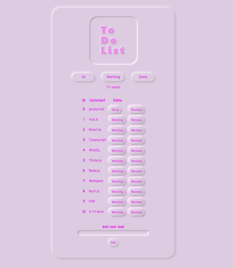

# 📝Neumorphic Todolist

### ⚙機能
- Vue.jsを使ったTodolist。
- working/doneを仕分けできる。
- Storage APIでデータの取得・保存。

### 📚学び
- テンプレート構文を使った宣言的なDOMレンダリング。
- ユーザによる入力データと同期し、DOMレンダリングをリアクティブにする。
- node.jsとexpressを使ったローカルサーバーの立ち上げ方。
- v-forやv-onといったディレクティブの使い方。
- 新しいデザイントレンド、Neumorphismの表現方法
