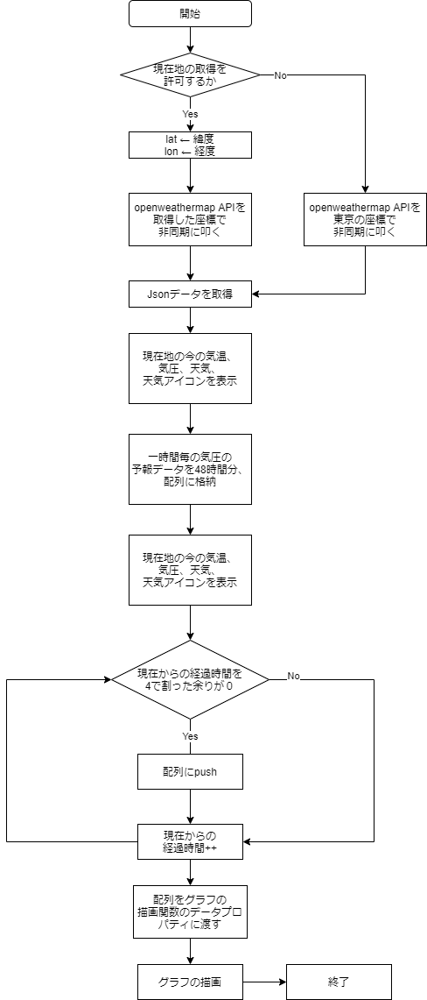

# 🌏気圧予報 Pressure Forecast

### ⚙機能
- 気圧による体調不良を把握するためのデータビジュアライゼーション。
- navigatorオブジェクトで現在地の緯度・経度を取得し、その座標に応じた気温や気圧をchart.jsで線グラフに描画する。

### 📊フローチャート

### 📚学び
- ブラウザの持つnavigatorオブジェクトを使った現在地の緯度・経度の取得方法
- async/awiatで非同期通信する方法
- 変数のスコープとreturnによる変数の受け渡しが上手くいかなかったため、今後、読みやすいコードにリファクタリングする
- [Paasを使ったデプロイ方法](https://weather-6bntrejoa.vercel.app/weather.html)